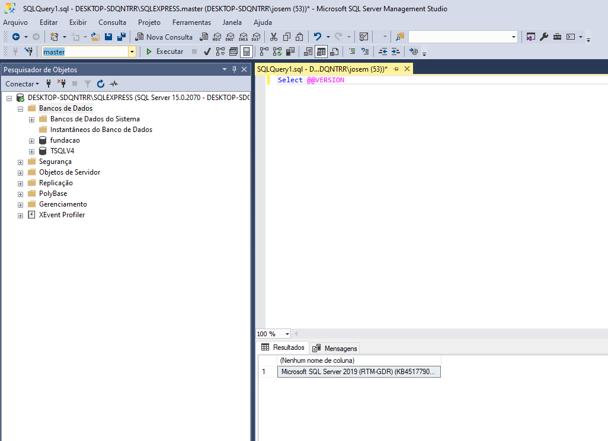

# SQL SERVER 2017 - Aprenda tudo sobre a linguagem SQL

https://www.udemy.com/course/sql-server-2017-fundamentos-profissionais-em-t-sql/


---

## <a name="indice">Índice</a>

- [Seção: 1 - Apresentação do curso](#parte1)   
- [Seção: 2 - Instalações](#parte2)   
- [Seção: 3 - MÓDULO 1 - INTRODUÇÃO](#parte3)   
- [Seção: 4 - Conhecimento teórico](#parte4)   
- [Seção: 5 - Arquitetura do SQL Server - Introdução](#parte5)   
- [Seção: 6 - Criando tabelas e suas integridades](#parte6)   
- [Seção: 7 - MÓDULO 2 - DETALHANDO A INSTRUÇÃO SELECT](#parte7)   
- [Seção: 8 - Instrução SELECT e seus elementos](#parte8)   
- [Seção: 9 - Elementos avançados do SELECT](#parte9)   
- [Seção: 10 - Dados Alfanuméricos](#parte10)   
- [Seção: 11 - Dados de Data e Hora](#parte11)   
- [Seção: 12 - MÓDULO 3 - JUNÇÕES](#parte12)   
- [Seção: 13 - Cross Join](#parte13)   
- [Seção: 14 - Inner Join](#parte14)   
- [Seção: 15 - Outer Join](#parte15)   
- [Seção: 16 - Além dos Join](#parte16)   


---

## <a name="parte1">Seção: 1 - Apresentação do curso</a>


[Voltar ao Índice](#indice)

---

## <a name="parte2">Seção: 2 - Instalações</a>




[Voltar ao Índice](#indice)

---

## <a name="parte3">Seção: 3 - MÓDULO 1 - INTRODUÇÃO</a>


[Voltar ao Índice](#indice)

---

## <a name="parte4">Seção: 4 - Conhecimento teórico</a>

- https://pt.wikipedia.org/wiki/SQL
- https://db-engines.com/en/
- https://pt.wikipedia.org/wiki/Programa%C3%A7%C3%A3o_declarativa

[Voltar ao Índice](#indice)

---

## <a name="parte5">Seção: 5 - Arquitetura do SQL Server - Introdução</a>

### 15 - Instância

```sql
/*
Assunto : Instância 

- Uma instalação do executável do mecanismo de 
  banco de dados que é executado
  como serviço no sistema operacional.

- Um servidor pode ter uma instâncias 
  ou várias instâncias. 

- Cada instância trabalha de forma 
  isolada, com seus banco de dados. 

- Conexões são feitas na instâncias - Logon 

- Para conectar é preciso: 
  IP, 
  Porta, 
  Login/Senha ou Autenticação Integrada.

- Gerenciamento é realizado pelo Configuration Manager

*/

Select @@servername , @@servicename 
```

[Voltar ao Índice](#indice)

---

## <a name="parte6">Seção: 6 - Criando tabelas e suas integridades</a>


[Voltar ao Índice](#indice)

---

## <a name="parte7">Seção: 7 - MÓDULO 2 - DETALHANDO A INSTRUÇÃO SELECT</a>


[Voltar ao Índice](#indice)

---

## <a name="parte8">Seção: 8 - Instrução SELECT e seus elementos</a>


[Voltar ao Índice](#indice)

---

## <a name="parte9">Seção: 9 - Elementos avançados do SELECT</a>


[Voltar ao Índice](#indice)

---

## <a name="parte10">Seção: 10 - Dados Alfanuméricos</a>


[Voltar ao Índice](#indice)

---

## <a name="parte11">Seção: 11 - Dados de Data e Hora</a>


[Voltar ao Índice](#indice)

---

## <a name="parte12">Seção: 12 - MÓDULO 3 - JUNÇÕES</a>


[Voltar ao Índice](#indice)

---

## <a name="parte13">Seção: 13 - Cross Join</a>


[Voltar ao Índice](#indice)

---

## <a name="parte14">Seção: 14 - Inner Join</a>


[Voltar ao Índice](#indice)

---

## <a name="parte15">Seção: 15 - Outer Join</a>


[Voltar ao Índice](#indice)

---

## <a name="parte16">Seção: 16 - Além dos Join</a>


[Voltar ao Índice](#indice)

---